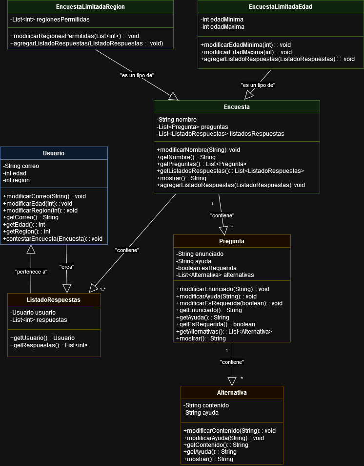

Modulo_4_Desafio_4

# Sistema de Gestión de Encuestas

## Descripción
Este proyecto implementa un sistema de gestión de encuestas que permite crear y contestar encuestas con diferentes tipos de restricciones. Desarrollado en Python utilizando programación orientada a objetos, el sistema maneja encuestas, preguntas, alternativas, usuarios y sus respuestas.

## Características principales
- Creación de encuestas generales y especializadas (limitadas por edad o región)
- Manejo de preguntas con múltiples alternativas
- Sistema de usuarios con restricciones de edad y región
- Capacidad para contestar encuestas y almacenar respuestas
- Diseño modular y extensible

## Estructura del proyecto
El proyecto está organizado en los siguientes archivos:

- `alternativa.py`: Contiene la clase `Alternativa`
- `pregunta.py`: Contiene la clase `Pregunta`
- `encuesta.py`: Contiene las clases `Encuesta`, `EncuestaLimitadaEdad` y `EncuestaLimitadaRegion`
- `usuario.py`: Contiene la clase `Usuario`
- `listado_respuestas.py`: Contiene la clase `ListadoRespuestas`
- `diagrama_clases.png`: Diagrama de clases del sistema

## Diagrama de Clases
El diagrama de clases del sistema ilustra las relaciones entre las diferentes clases:

### Clases principales:
1. `Alternativa`: Representa las opciones de respuesta para una pregunta.
2. `Pregunta`: Contiene el enunciado y las alternativas de una pregunta.
3. `Encuesta`: Clase base para todas las encuestas.
4. `EncuestaLimitadaEdad`: Encuesta con restricciones de edad.
5. `EncuestaLimitadaRegion`: Encuesta con restricciones de región.
6. `Usuario`: Representa a un usuario del sistema.
7. `ListadoRespuestas`: Almacena las respuestas de un usuario a una encuesta.

## Contribuir
Si deseas contribuir al proyecto, por favor:

1. Haz un fork del repositorio
2. Crea una nueva rama (`git checkout -b feature/AmazingFeature`)
3. Haz commit de tus cambios (`git commit -m 'Add some AmazingFeature'`)
4. Haz push a la rama (`git push origin feature/AmazingFeature`)
5. Abre un Pull Request

------------------------------------------

## Prerequisitos

- Sistema Operativos: Windows 10, 11, Linux, iOS
- Python 3.12

## Ejecución

***Windows***

`python encuesta.py`

***Linux & iOS***

`python3 encuesta.py`

------------------------------------------
## Colaboradores
- [Francisco Colomer](https://github.com/Cy5k0) 
- [Francisco Monroy](https://github.com/fmonroy75)
- [Natalia Peña](https://github.com/StudentNPD)
